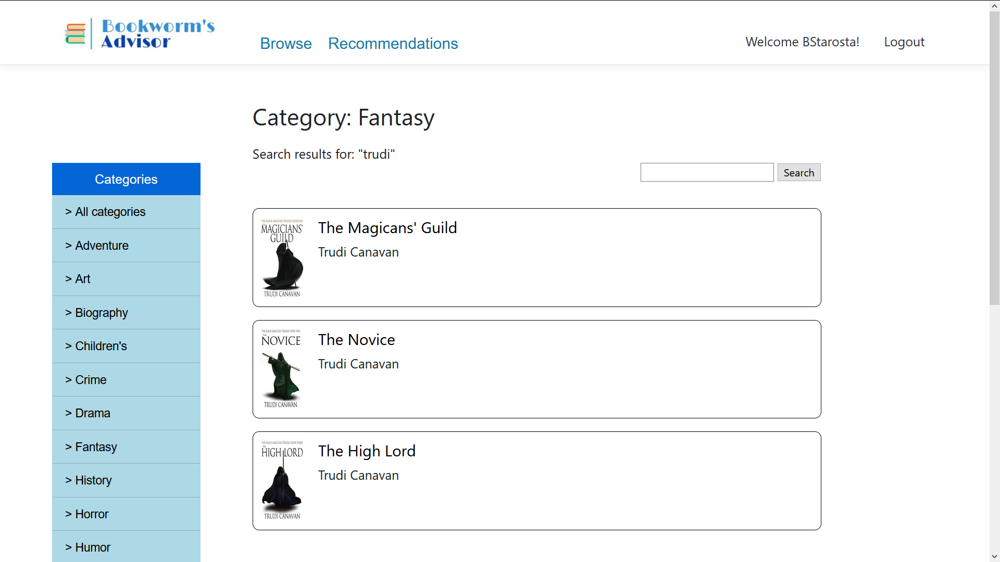
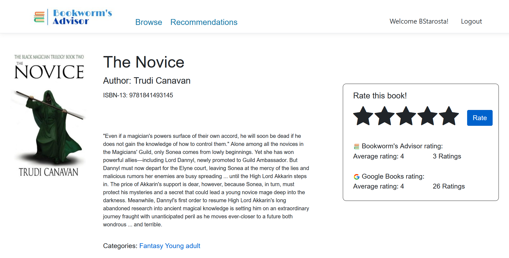
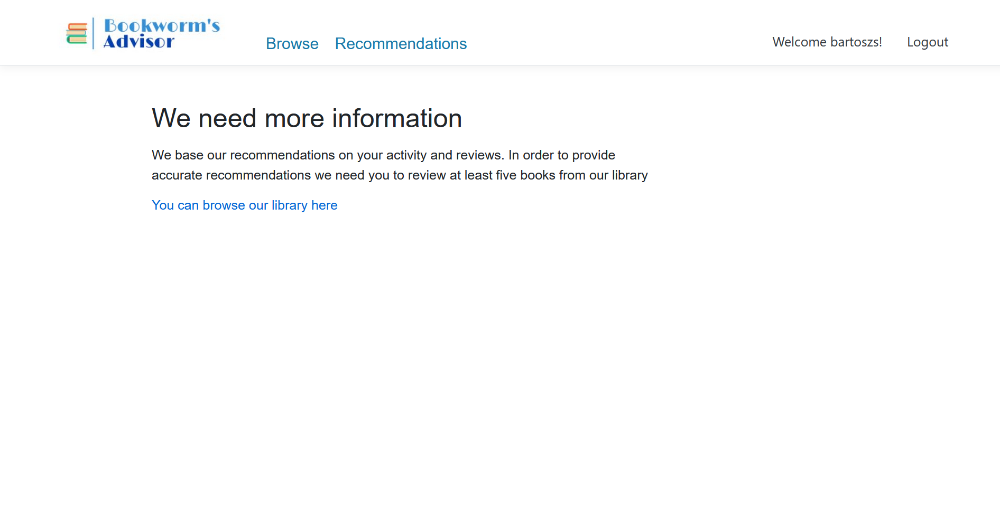
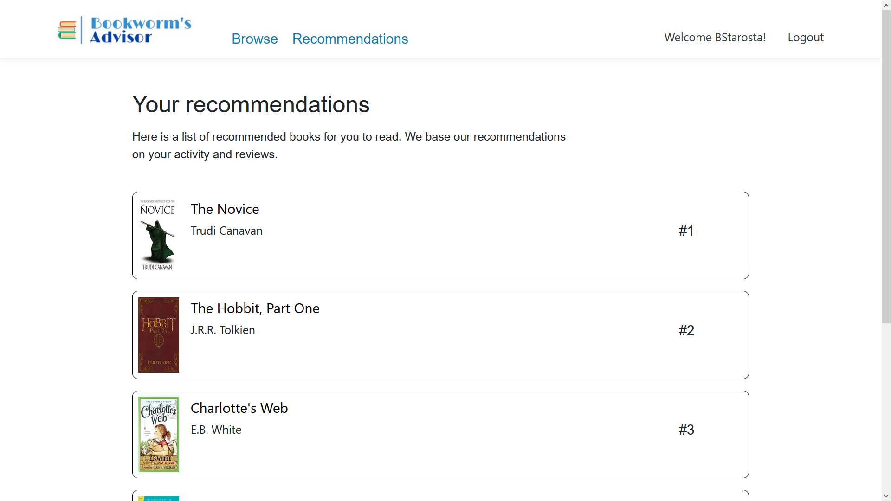
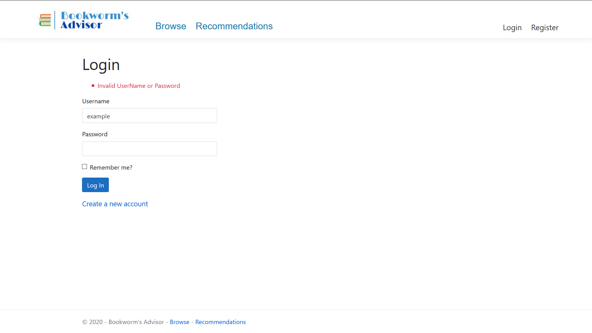
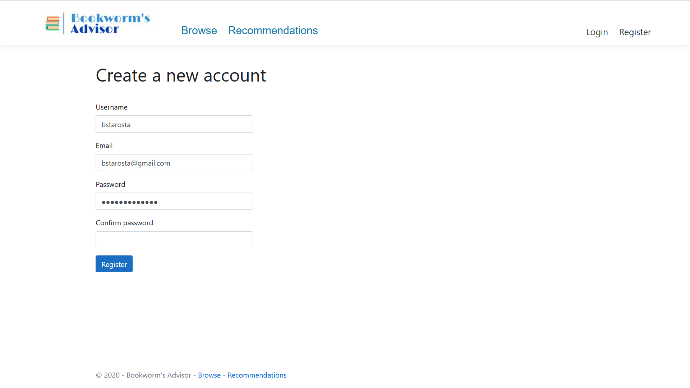
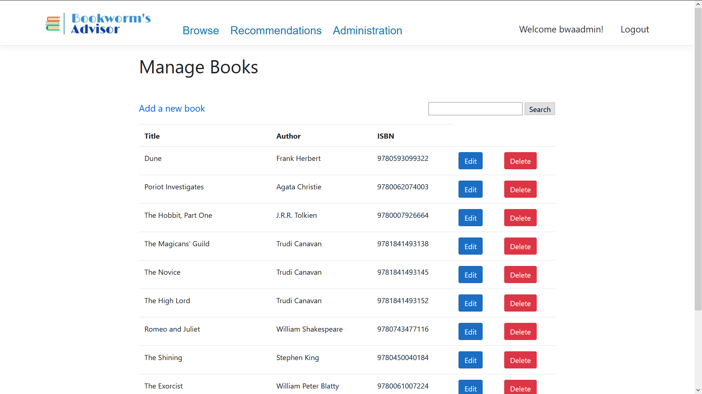
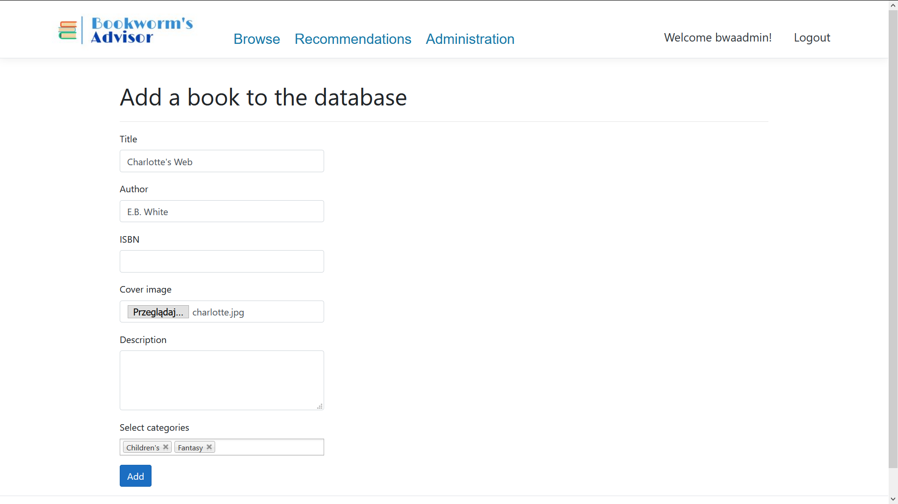

# BookRecommendationWebApp
A .NET Core web application. The main purpose of this application is providing accurate book recomendations. The application estimates user preferences based on their reviews. It uses a content-based filtering algorithm to select appropriate book recomendations.

Main features:
* User login and regisration
* Browsing resources of application's book library
* Displaying detailed information about books in application's library
* Book recomendations based on users' reviews
* Administration panel for easy book library management
* Displaying user review history

## Built with
* [Visual Studio](https://visualstudio.microsoft.com/pl/)
* [.NET Core 3.1](https://dotnet.microsoft.com/learn/dotnet/what-is-dotnet)
* [Microsoft SQL Server](https://www.microsoft.com/pl-pl/sql-server/sql-server-2019)
* [Bootstrap](https://getbootstrap.com/)
* [Sourcetree](https://www.sourcetreeapp.com/)

## Screenshots
|  |  |
|:------------------------------------:|:---------------------------------:|
|  |  |
|  |  |
|  |  |
